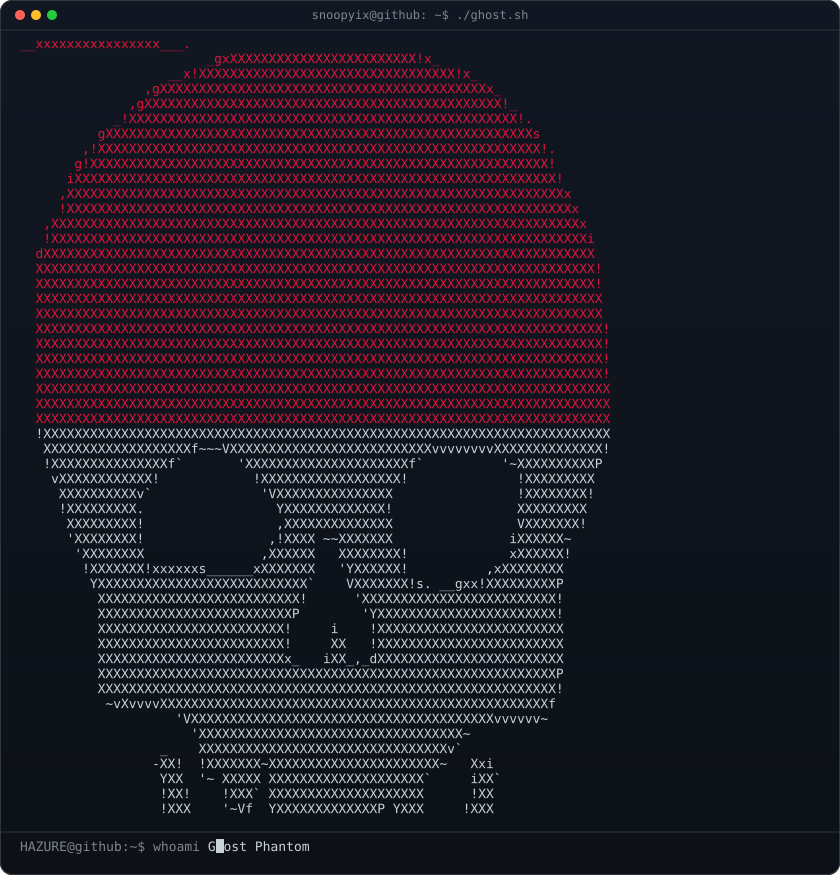

<!-- hero: monochrome ASCII portrait (types in) beside the extruded 3d ascii
     wordmark (wipes in left-to-right, then rocks on its vertical axis).
     widths are picked so both panels land at the same height.
     portrait: python scripts/prep_photo.py <photo> && python scripts/make_ascii_svg.py
     wordmark: python scripts/make_wordmark_svg.py --mode rock
     how the wordmark is built: docs/3d-ascii-wordmark.md -->

<h3><code>snoopyix@github ~ $ whoami</code></h3>

<table>
<tr>
<td valign="top"></td>
<td valign="top"></td>
</tr>
</table>

 
 

<!-- animated contribution graph: real data, boxes reveal cell by cell
     (regenerated daily by .github/workflows/update-profile-art.yml) -->

<h3><code>snoopyix@github ~ $ ./links.sh</code></h3>

<b>Automation Developer · AI Builder · Rookieb>

 

  

<h1 align="center">
  
</h1>

  
  
  

### 👽 Software Developer in Training 
**Técnico em Desenvolvimento de Sistemas |Future Software Engineer**
               <h3 align="center">Back-End • UX/UI • Software Architecture</h3>
---

---
Comprometido em aprender os fundamentos que sustentam softwares de alto impacto. Focado em evoluir minhas habilidades técnicas e analíticas para criar sistemas eficientes, escaláveis e elegantes.

---
### 🎓 Certificações / Cursos

* **Ciência de Dados** - Alura
* **Clusterização de Dados** - Alura
* **Java Intermediario** - Fernanda Kipper
* **Python Avançado** - Didatica Tech
* **Teoria da  Ciência Computação** - Khan Academy
* **JavaScript basico** - Khan Academy
* **Machine Learning basico** - Alura
* **PCA - Análise de componentes principais** - Alura
* **Programação Orientada a Objetos em Python** - Hashtag

### 🛠️ Tecnologias & Stack
Para construir aplicações eficientes, utilizo as seguintes linguagens e tecnologias:

---

### 💻 Ferramentas & IDEs
Meu ecossistema de desenvolvimento focado em produtividade e qualidade:

---
### 🎨 Design & Visual
Habilidades criativas que complementam meu perfil técnico, permitindo a criação de interfaces modernas e assets visuais:

---
---

## 📬 Contato Rápido

  
  

### 🚀 Let's code and make the future!
